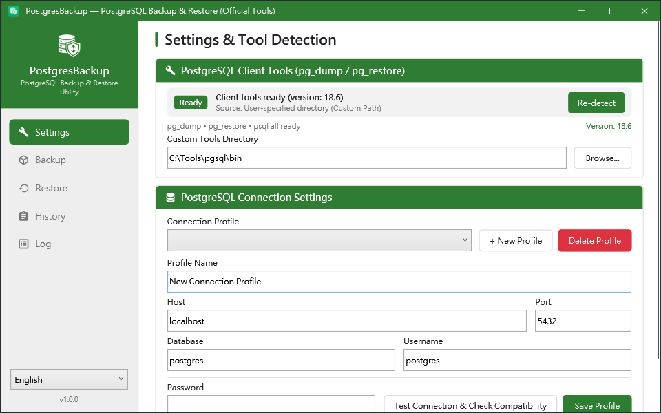
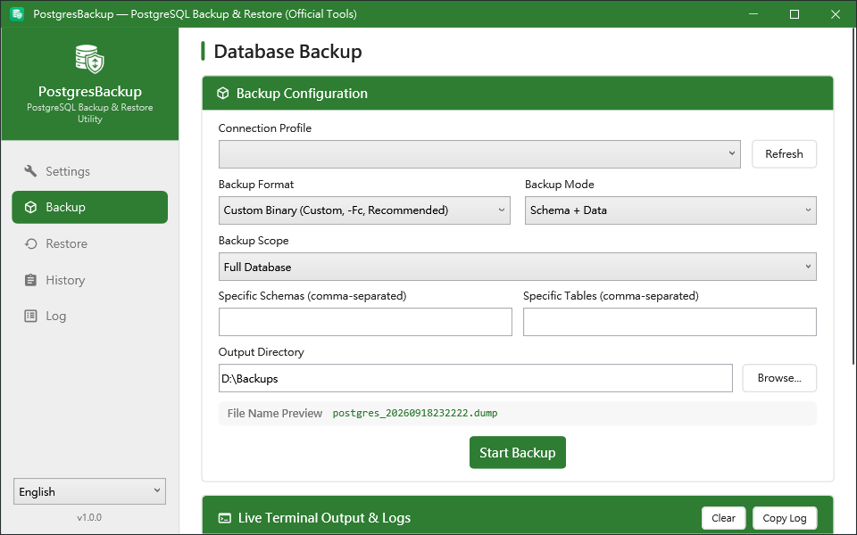
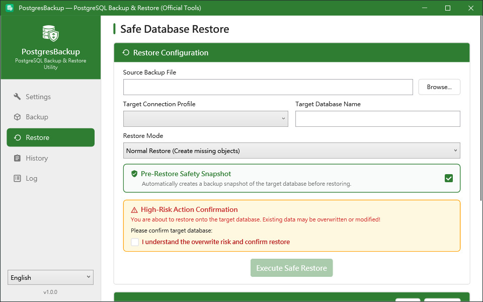
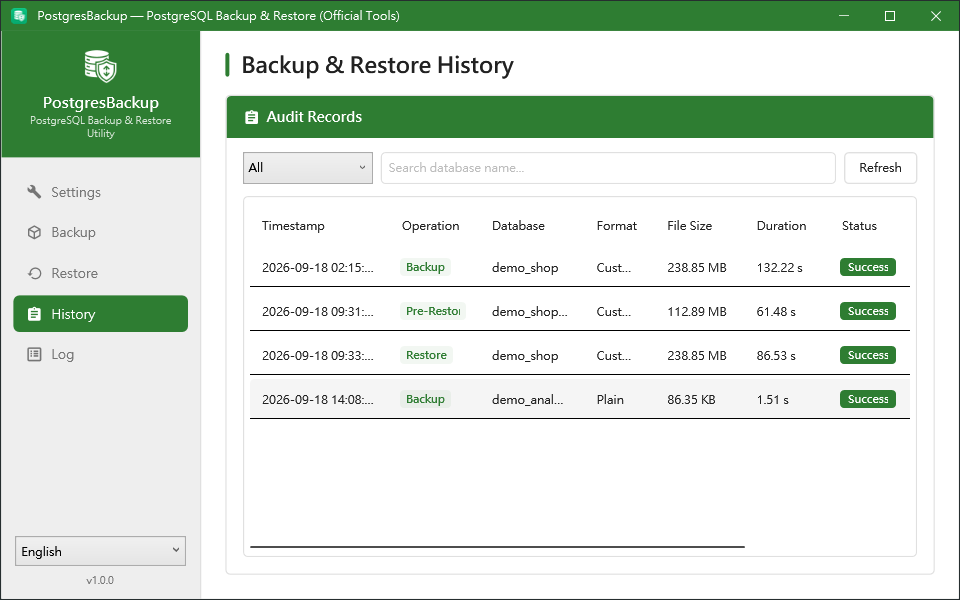

[English](README.md) | [繁體中文](README.zh-TW.md)

# PostgresBackup


A PostgreSQL backup and restore tool built on the official `pg_dump` / `pg_restore` / `psql` binaries — with a modern WPF desktop UI, a scriptable CLI, and a mandatory pre-restore snapshot so a restore can never be the last thing that happens to your data.

No custom dump parser. No reinvented wire protocol. Just the official tools, driven safely.

## Table of Contents

- [Why PostgresBackup?](#why-postgresbackup)
- [Features](#features)
- [Screenshots](#screenshots)
- [Getting Started](#getting-started)
- [Installing the PostgreSQL Client Tools](#installing-the-postgresql-client-tools)
- [CLI Usage](#cli-usage)
- [WPF Desktop Application](#wpf-desktop-application)
- [Scheduled Backups](#scheduled-backups)
- [Where Data Is Stored](#where-data-is-stored)
- [Security](#security)
- [Building from Source](#building-from-source)
- [Documentation](#documentation)
- [License](#license)

## Why PostgresBackup?

`pg_dump` and `pg_restore` are excellent, and nothing should replace them. What they lack is the operational layer around them: a safe default for destructive restores, a place to keep connection profiles without plaintext passwords, an audit trail of what was backed up and when, and a UI a colleague can use without memorising twenty flags.

Third-party tools that re-implement dumping in managed code trade that away — the moment a data type round-trips through someone's own parser, fidelity becomes a maintenance promise rather than a guarantee.

PostgresBackup takes the other path:

- **Official tools only:** every backup is a real `pg_dump` invocation; every restore is `pg_restore` or `psql`. The output files are ordinary PostgreSQL dumps, readable by any standard tooling.
- **Safe by default:** a restore builds a defensive snapshot of the target database *first*. If the snapshot fails, the restore does not run.
- **No plaintext credentials at rest:** GUI connection profiles keep passwords in Windows Credential Manager; CLI connection profiles (`pgbackup profile set`) keep them in their own machine-scoped encrypted store, purpose-built for `SYSTEM`-run scheduled tasks. Passwords reach the child `pg_dump` / `pg_restore` process through the `PGPASSWORD` environment variable, never on its command line. See [Security](#security) for exactly who can read what.
- **Auditable:** backups, restores and snapshots are all written to a local SQLite history you can search and act on.

## Features

- Backup via official `pg_dump` — Custom (`-Fc`) or Plain SQL (`-Fp`) format
- Backup modes: schema + data, schema only, data only
- Backup scopes: full database, specific schemas, or specific tables
- Restore via `pg_restore` (`.dump`) or `psql` (`.sql`), in normal / clean-and-recreate / data-only modes
- **Pre-restore snapshot** — a defensive full backup taken before any destructive restore (on by default)
- Typed-confirmation guard in the UI before a restore can be executed
- Client tool auto-detection with client/server version compatibility checking
- Connection profiles for the GUI (Windows Credential Manager) and, independently, for the CLI and scheduled tasks (`pgbackup profile`, machine-scoped encryption)
- Immutable SQLite audit history, searchable and filterable by operation type
- Live streaming of the underlying tool's output in both the UI and the CLI
- CLI (`pgbackup`) for Task Scheduler, CI/CD and automation
- Runtime language switching (English / 繁體中文)

## Screenshots

### Settings — environment check and connection profiles


### Backup


### Restore — pre-restore snapshot and typed confirmation


### History — immutable audit trail


## Getting Started

### Prerequisites

- Windows 10 / 11 or Windows Server 2019+
- PostgreSQL official client tools (`pg_dump`, `pg_restore`, `psql`) — see [below](#installing-the-postgresql-client-tools)
- PostgreSQL 12 ~ 18.x server

No .NET runtime is required: both downloads are self-contained single-file executables.

### Download

Grab the latest release from the [Releases](https://github.com/lawrence8358/PostgresBackup/releases) page:

| Package | Contents |
|---------|----------|
| `PostgresBackup-wpf-win-x64-v<version>.zip` | `PostgresBackup.Wpf.exe` — the desktop application |
| `PostgresBackup-cli-win-x64-v<version>.zip` | `pgbackup.exe` — the command-line tool |

Each archive holds a single self-contained executable plus the LICENSE and docs. Unzip anywhere and run — nothing is written to the registry.

## Installing the PostgreSQL Client Tools

PostgresBackup calls the official binaries, so they must be present on the machine. The client major version must be **greater than or equal to** the server's — `pg_dump` 16 cannot dump a PostgreSQL 18 server.

Everything referenced here is covered by the **PostgreSQL License** (an OSI-approved permissive licence comparable to MIT/BSD) and is free for commercial and production use, including inside proprietary systems.

### Option A — portable EDB binaries (recommended)

No installer, no admin rights, no registry writes.

1. Download the **Windows x86-64** ZIP from [PostgreSQL Windows Binaries (EDB)](https://www.enterprisedb.com/download-postgresql-binaries).
2. Extract the `pgsql` folder somewhere stable, e.g. `C:\Tools\pgsql\`.
3. Point PostgresBackup at `C:\Tools\pgsql\bin`, via `--pg-bin-path` or the Settings page.

### Option B — winget

```powershell
winget install PostgreSQL.PostgreSQL.18
```

The tools land in `C:\Program Files\PostgreSQL\18\bin` and are added to `PATH`, so PostgresBackup finds them automatically.

### Verifying

```powershell
pgbackup check-tools --pg-bin-path "C:\Tools\pgsql\bin"
```

```text
================================================================================
  PostgreSQL Client Tools Diagnostic Report
================================================================================
  Status     : [ READY ]
  Source     : CustomPath
  pg_dump    : C:\Tools\pgsql\bin\pg_dump.exe
  pg_restore : C:\Tools\pgsql\bin\pg_restore.exe
  psql       : C:\Tools\pgsql\bin\psql.exe
  Version    : 18.6
================================================================================
```

## CLI Usage

```bash
# One-time setup: create a CLI connection profile for unattended use (interactive, masked password prompt)
pgbackup profile set --name "prod" -H localhost -d my_database -u postgres

# Diagnose the local tool installation
pgbackup check-tools

# Diagnose, and also verify client/server version compatibility, using the saved profile
pgbackup check-tools --profile "prod"

# Full database backup, Custom format
pgbackup backup --profile "prod" -f custom -o "D:\Backups"

# Schema-only backup, as a readable .sql script
pgbackup backup --profile "prod" -f plain -m schema -o "D:\Backups"

# Back up two schemas only
pgbackup backup --profile "prod" -n public -n hangfire -o "D:\Backups"

# Restore — takes a pre-restore snapshot automatically, prompts before overwriting
pgbackup restore -f "D:\Backups\my_database_20260917235837.dump" --profile "prod"

# Restore unattended (for scripts): skip the prompt, keep the snapshot
pgbackup restore -f "D:\Backups\my_database_20260917235837.dump" --profile "prod" --yes
```

`-p "secret"` also works in place of `--profile` on `check-tools`, `backup` and `restore`, but it is for interactive, manual debugging only — see [Security](#security) for why. Never put `-p` in a script.

### Command Reference

| Command | Description |
|---------|-------------|
| `check-tools` | Report client tool paths, versions and readiness; optionally check server compatibility |
| `backup` | Run a backup with `pg_dump` |
| `restore` | Run a restore with `pg_restore` / `psql`, preceded by a safety snapshot |
| `profile` | Manage CLI connection profiles used by `--profile` (independent from GUI connection profiles) |

**Connection options** — accepted by `check-tools`, `backup` and `restore`:

| Option | Alias | Description |
|--------|-------|-------------|
| `--profile` | | Use a saved CLI connection profile, by name or id |
| `--host` | `-H` | Server host |
| `--port` | `-P` | Server port (default `5432`) |
| `--database` | `-d` | Database name |
| `--username` | `-u` | Username |
| `--password` | `-p` | Password. **Interactive debugging only** — it is visible on `pgbackup.exe`'s own process command line (e.g. via Task Manager or `Get-CimInstance Win32_Process`); the CLI prints a runtime warning when it is used. Never use it in a scheduled script — use `--profile` instead |
| `--pg-bin-path` | | Directory containing the official client tools |

Explicit options override the values taken from `--profile`.

**`profile` — manage CLI connection profiles**

| Subcommand | Description |
|------------|-------------|
| `set` | Create or update a profile (same `--name` updates it). Password is read via a masked interactive prompt, or piped in with `--password-stdin` — there is no flag to pass the password as an argument. Verifies the connection before saving unless `--force` is given (prints a warning when forced) |
| `list` | List all CLI connection profiles, with password status (`set` / `missing`, never the password itself) and a warning if the store's file permissions look wrong |
| `remove` | Delete a profile and wipe its encrypted password (`--name`) |

```powershell
# Masked interactive prompt
pgbackup profile set --name "prod" -H localhost -P 5432 -d my_database -u postgres

# Automation-friendly: pipe the password in over stdin, so it never appears on pgbackup's own command line.
# Note that the LEFT side of the pipe matters just as much — a literal password there still lands in
# your shell history. Read it from a permission-controlled file or an injected secret instead.
Get-Content -Raw "C:\ProgramData\deploy-secrets\db.secret" | `
    pgbackup profile set --name "prod" -H localhost -d my_database -u postgres --password-stdin

# List profiles and check the store's permissions
pgbackup profile list

# Remove a profile
pgbackup profile remove --name "prod"
```

**`backup` options**

| Option | Alias | Description |
|--------|-------|-------------|
| `--format` | `-f` | `custom` (`-Fc`, default) or `plain` (`-Fp`) |
| `--mode` | `-m` | `all` (schema + data), `schema`, or `data` |
| `--schema` | `-n` | Restrict to a schema; repeatable |
| `--table` | `-t` | Restrict to a table, e.g. `public.Quote`; repeatable |
| `--output-dir` | `-o` | Output directory (default: `Documents\PostgresBackups`) |
| `--output-file` | | Explicit output file path, overriding the generated name |
| `--log` | | Also append the run log to this file |

Generated file names follow `{database}_{yyyyMMddHHmmss}.dump`, or `.sql` for plain format.

**`restore` options**

| Option | Alias | Description |
|--------|-------|-------------|
| `--file` | `-f` | **Required.** Source backup file (`.dump` or `.sql`) |
| `--mode` | `-m` | `normal` (default), `clean` (`--clean --if-exists`), or `data` (`--data-only`) |
| `--no-snapshot` | | Disable the pre-restore safety snapshot |
| `--yes` | `-y` | Skip the interactive destructive-operation confirmation |
| `--log` | | Also append the run log to this file |

> **`--no-snapshot` removes your undo.** The snapshot is what lets you get back to the pre-restore state when the dump turns out to be the wrong one. Use it only when the target database is disposable.

**`check-tools` options**

| Option | Alias | Description |
|--------|-------|-------------|
| `--connection-string` | `-s` | Full connection string, used for the server compatibility check. **Interactive debugging only** — the same command-line exposure as `-p` applies; never use it in a scheduled script |
| `--json` | | Emit the report as JSON, for scripted health checks |

The CLI exits `0` on success and non-zero on failure, so it composes normally with scripts and CI steps.

## WPF Desktop Application

Four pages, in the order you would use them:

1. **Settings** — detect or point at the client tools, then create connection profiles. Passwords go to Windows Credential Manager; the profile file itself holds no secrets. "Test connection" also reports client/server version compatibility. These GUI profiles are for this application only — scheduled tasks and the CLI use their own profiles, created with `pgbackup profile set` (see [Scheduled Backups](#scheduled-backups) and [Security](#security)).
2. **Backup** — pick a profile, choose format / mode / scope, and watch the output file name preview update live. Execution streams in the backup page terminal.
3. **Restore** — pick a backup file and a target. The pre-restore snapshot is checked by default. The execute button stays locked until you retype the target database name and acknowledge the overwrite risk.
4. **History** — every backup, restore and snapshot, filterable by type or database name, with "reveal in Explorer" and one-click "restore this file".

The language switcher (English / 繁體中文) at the bottom of the sidebar applies immediately, with no restart.

## Scheduled Backups

The CLI is built for unattended operation. The `scripts/` directory ships three ready-to-use scripts, none of which contain a database password:

| Script | Purpose | Needs admin? |
| :--- | :--- | :---: |
| [`scripts/register-backup-task.ps1`](scripts/register-backup-task.ps1) | One-time setup: create the profile, register the SYSTEM task, run it once to verify | Yes |
| [`scripts/backup_task.ps1`](scripts/backup_task.ps1) | What the task runs every day (retention policy and log rotation included) | Handled by the task |
| [`scripts/check-backup-status.ps1`](scripts/check-backup-status.ps1) | Check how the scheduled backups are doing | **No** |
| [`scripts/unregister-backup-task.ps1`](scripts/unregister-backup-task.ps1) | Remove the schedule (by default it stops the task and keeps every backup) | Yes |

```powershell
# Set up once, as an administrator
cd scripts
.\register-backup-task.ps1

# Check any time, as yourself
.\check-backup-status.ps1 -BackupDir "D:\DatabaseBackups\my_database"
```

The task always runs as `SYSTEM`, never a personal account — a personal account's password expiring (a common corporate policy) makes the task fail silently, while `SYSTEM` has no password to expire and can read the CLI connection profile store.

**Checking backup results does not require administrator rights.** Elevation is only needed to read the connection profile store (`pgbackup profile list`), because that is where the password lives.

Per-script parameters are documented in [`scripts/README.md`](scripts/README.md); the full scheduling SOP and a map of every file and path it touches are in the [User Manual, §5](docs/USER_MANUAL.md#5-cli-自動化排程備份實戰指南-sop).

## Where Data Is Stored

GUI connection profiles and CLI connection profiles are independent — a profile created in one is **not** visible to the other; this is intentional, not a bug.

| What | Location | Used by |
|------|----------|---------|
| GUI connection profiles | `%APPDATA%\PostgresBackup\connections.json` | WPF app only |
| GUI connection profile passwords | Windows Credential Manager (per user) | WPF app only |
| CLI connection profiles (`pgbackup profile`) | `%ProgramData%\PostgresBackup\cli-connection-profiles.json` | CLI and its scheduled tasks |
| CLI connection profile passwords | `%ProgramData%\PostgresBackup\cli-credentials.dat` (machine-scoped encryption) | CLI and its scheduled tasks |
| Audit history | `%LOCALAPPDATA%\PostgresBackup\history.db` (SQLite) | Per Windows account — see the note below |
| Default backup output | `%USERPROFILE%\Documents\PostgresBackups` | Both |

> **The audit history is per Windows account, not per machine.** `%LOCALAPPDATA%` resolves differently for every account, so a scheduled task running as `SYSTEM` writes its history to `C:\Windows\System32\config\systemprofile\AppData\Local\PostgresBackup\history.db`. Those runs will **not** appear on the GUI's History page, which reads the history of the account you are signed in as. The backup files themselves are unaffected — only the audit record lives somewhere else. Use the CLI's exit code and `--log` to monitor scheduled runs.

## Security

Passwords never sit in plaintext scripts or config files. GUI connection profiles hand passwords to Windows Credential Manager; CLI connection profiles encrypt them with Windows' machine-scoped Data Protection API, so the encrypted file only opens on the machine that created it, and only Administrators / `SYSTEM` can read the store on that machine — **including any local administrator, by design**: no local credential protection on Windows can be made to withstand someone who already has admin rights on the box, and this tool does not pretend otherwise. `-p` and `--connection-string` are kept for interactive debugging only and are never safe to put in a script. The full breakdown — who can read what, and exactly what is and isn't protected — is in the [User Manual, §6 Security Notes](docs/USER_MANUAL.md#6-安全性說明).

## Building from Source

Requires the .NET 10 SDK.

```powershell
dotnet build PostgresBackup.sln
dotnet test PostgresBackup.sln
```

To produce the release artifacts — self-contained, single-file, no runtime needed on the target machine:

```powershell
.\build.ps1
```

This writes to `dist/` — both the release archives and the unpacked executables, so you can smoke-test a build before publishing it:

```
dist/
├── cli/pgbackup.exe
├── wpf/PostgresBackup.Wpf.exe
├── PostgresBackup-cli-win-x64-v<version>.zip
└── PostgresBackup-wpf-win-x64-v<version>.zip
```

The version is read from the project files, so bumping `<Version>` is all that is needed for the next release. `.\build.ps1 -Version 1.1.0` overrides it for a one-off build, and `-Runtime win-arm64` targets a different architecture.

## Documentation

- [User Manual (繁體中文)](docs/USER_MANUAL.md) — full walkthrough, tool installation SOP, scheduling guide and FAQ
- [Product Context](PRODUCT.md) — vision, target users and design guardrails
- [Domain Model](CONTEXT.md) — project terminology
- [Design Notes](DESIGN.md) — architecture

## License

MIT — see [LICENSE](LICENSE).

PostgresBackup invokes the PostgreSQL client tools but does not redistribute them; those are separately licensed under the PostgreSQL License.
