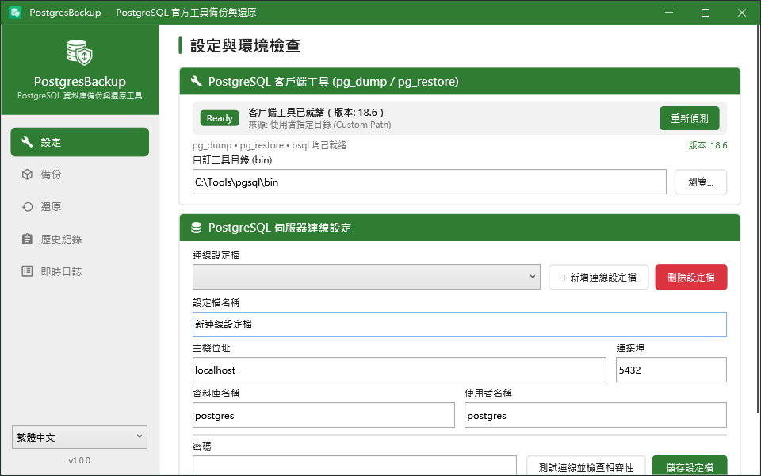
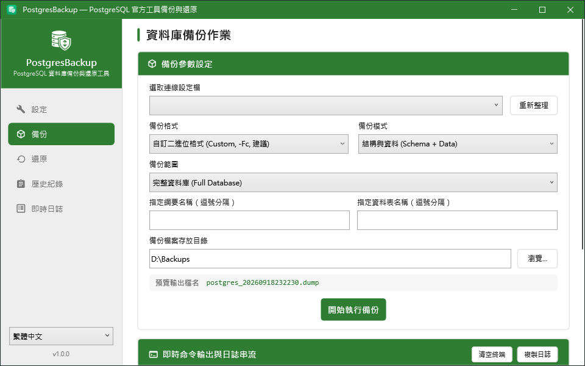
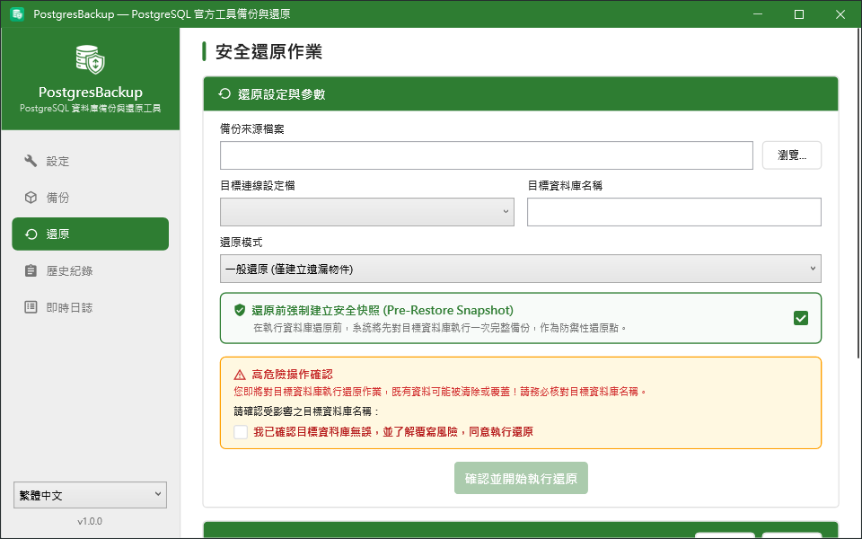
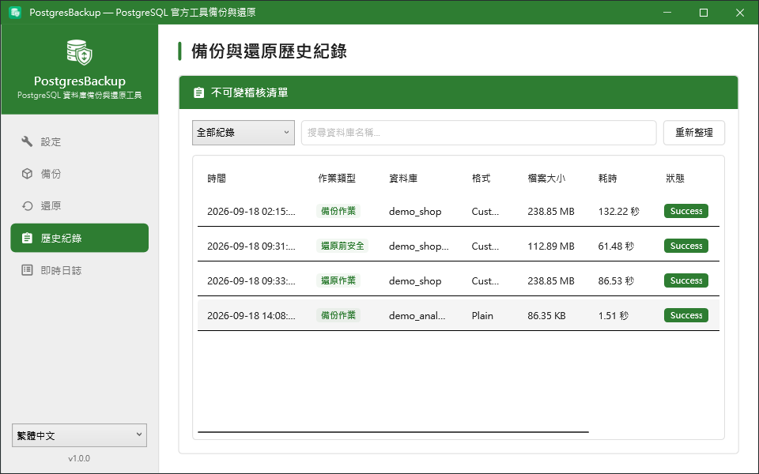
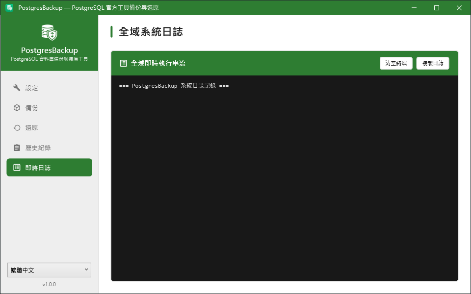

[English](README.md) | [繁體中文](README.zh-TW.md)

# PostgresBackup


基於 PostgreSQL 官方 `pg_dump` / `pg_restore` / `psql` 打造的資料庫備份與還原工具 — 提供現代化 WPF 桌面介面、可腳本化的 CLI，以及還原前強制建立的安全快照，讓「還原」永遠不會是資料的最後一步。

沒有自製的 dump 解析器，沒有重造的通訊協定，只有官方工具，加上一層安全的操作機制。

## 目錄

- [為什麼需要 PostgresBackup？](#為什麼需要-postgresbackup)
- [功能特色](#功能特色)
- [功能展示](#功能展示)
- [快速開始](#快速開始)
- [安裝 PostgreSQL 官方客戶端工具](#安裝-postgresql-官方客戶端工具)
- [CLI 使用說明](#cli-使用說明)
- [WPF 桌面應用程式](#wpf-桌面應用程式)
- [排程備份](#排程備份)
- [資料儲存位置](#資料儲存位置)
- [安全性說明](#安全性說明)
- [從原始碼建置](#從原始碼建置)
- [開發者文件](#開發者文件)
- [授權](#授權)

## 為什麼需要 PostgresBackup？

`pg_dump` 與 `pg_restore` 本身已經非常優秀，不需要也不應該被取代。它們缺少的是外圍的維運層：破壞性還原的安全預設值、不以明文儲存密碼的連線設定檔管理、「什麼時候備份了什麼」的稽核軌跡，以及一個不必背二十個參數就能操作的介面。

以受管程式碼重新實作傾印邏輯的第三方工具，等於放棄了這一點 — 當資料型別經過別人自製的解析器來回轉換，資料保真度就從「保證」降級成「維護承諾」。

PostgresBackup 選擇另一條路：

- **只使用官方工具：** 每次備份都是真正的 `pg_dump` 呼叫，每次還原都由 `pg_restore` 或 `psql` 執行。產出的就是標準 PostgreSQL 備份檔，任何標準工具都讀得懂。
- **安全為預設值：** 還原前會**先**對目標資料庫建立防禦性快照；快照失敗，還原就不會執行。
- **靜態儲存無明文憑證：** 介面連線設定的密碼交由 Windows Credential Manager 保管；命令列連線設定（`pgbackup profile set`）另有自己的機器範圍加密存放區，專為以 `SYSTEM` 身分執行的排程任務設計。密碼傳遞給子處理序 `pg_dump` / `pg_restore` 時，一律透過 `PGPASSWORD` 環境變數，絕不出現在其命令列上。誰能讀到什麼，詳見[安全性說明](#安全性說明)。
- **可稽核：** 備份、還原與安全快照全數寫入本機 SQLite 歷史紀錄，可查詢、可直接操作。

## 功能特色

- 以官方 `pg_dump` 執行備份 — 自訂二進位格式（Custom, `-Fc`）或純文字格式（Plain SQL, `-Fp`）
- 備份模式：結構與資料、僅結構、僅資料
- 備份範圍：完整資料庫、指定綱要（Schema）、指定資料表（Table）
- 以 `pg_restore`（`.dump`）或 `psql`（`.sql`）還原，支援一般 / 清除重建 / 僅資料三種模式
- **還原前安全快照（Pre-Restore Snapshot）** — 任何具破壞性的還原前自動執行防禦性全庫備份（預設啟用）
- 介面提供輸入資料庫名稱的雙重確認防呆機制，未確認前無法執行還原
- 客戶端工具自動偵測，並檢驗客戶端與伺服器的版本相容性
- 連線設定檔管理：介面連線設定（Windows Credential Manager）與 CLI／排程專用之命令列連線設定（`pgbackup profile`，機器範圍加密）各自獨立
- 不可變的 SQLite 稽核歷史，可依作業類型與關鍵字篩選
- WPF 與 CLI 皆即時串流底層工具的執行輸出
- CLI（`pgbackup`）可整合 Windows 工作排程器、CI/CD 與自動化流程
- 執行時語系切換（English / 繁體中文）

## 功能展示

### 設定 — 環境檢查與連線設定檔


### 備份


### 還原 — 安全快照與雙重確認防呆


### 歷史紀錄 — 不可變稽核軌跡


### 即時日誌


## 快速開始

### 環境需求

- Windows 10 / 11 或 Windows Server 2019+
- PostgreSQL 官方客戶端工具（`pg_dump`、`pg_restore`、`psql`）— 請見[下一節](#安裝-postgresql-官方客戶端工具)
- PostgreSQL 12 ~ 18.x 伺服器

無須安裝 .NET 執行階段：兩個下載檔皆為自我包含的單一可執行檔。

### 下載

請至 [Releases](https://github.com/lawrence8358/PostgresBackup/releases) 頁面取得最新版本：

| 封裝 | 內容 |
|------|------|
| `PostgresBackup-wpf-win-x64-v<version>.zip` | 桌面應用程式 `PostgresBackup.Wpf.exe` |
| `PostgresBackup-cli-win-x64-v<version>.zip` | 命令列工具 `pgbackup.exe` |

每個壓縮檔內含一個自我包含的單一可執行檔，以及 LICENSE 與說明文件。解壓縮至任意目錄即可執行，不寫入登錄檔。

## 安裝 PostgreSQL 官方客戶端工具

PostgresBackup 呼叫官方二進位檔，因此本機必須具備這些工具。客戶端主版本必須**大於或等於**伺服器版本 — `pg_dump` 16 無法傾印 PostgreSQL 18 的資料庫。

本節提及之所有工具均採用 **PostgreSQL License**（OSI 認證之寬鬆授權，性質與 MIT / BSD 相當），可免費用於商業與正式生產環境，亦可用於專有閉源系統。

### 方法 A：EDB 可攜式免安裝版（最推薦）

免安裝程式、免管理員權限、不寫入登錄檔。

1. 至 [PostgreSQL Windows Binaries (EDB)](https://www.enterprisedb.com/download-postgresql-binaries) 下載 **Windows x86-64** ZIP 壓縮檔。
2. 將 `pgsql` 目錄解壓至固定路徑，例如 `C:\Tools\pgsql\`。
3. 於 PostgresBackup 中指定 `C:\Tools\pgsql\bin`（CLI 使用 `--pg-bin-path`，WPF 於設定頁填入）。

### 方法 B：winget 套件管理員

```powershell
winget install PostgreSQL.PostgreSQL.18
```

工具將安裝至 `C:\Program Files\PostgreSQL\18\bin` 並加入 `PATH`，PostgresBackup 會自動偵測到。

### 驗證工具就緒狀態

```powershell
pgbackup check-tools --pg-bin-path "C:\Tools\pgsql\bin"
```

```text
================================================================================
  PostgreSQL 客戶端工具診斷報告 (Client Tools Diagnostic Report)
================================================================================
  工具狀態: [ 就緒 / READY ]
  偵測來源: CustomPath
  pg_dump   : C:\Tools\pgsql\bin\pg_dump.exe
  pg_restore: C:\Tools\pgsql\bin\pg_restore.exe
  psql      : C:\Tools\pgsql\bin\psql.exe
  工具版本  : 18.6
================================================================================
```

## CLI 使用說明

```bash
# 一次性設定：建立供無人值守使用的命令列連線設定（互動式遮蔽輸入密碼）
pgbackup profile set --name "正式環境" -H localhost -d my_database -u postgres

# 診斷本機工具安裝狀態
pgbackup check-tools

# 診斷並一併檢驗客戶端與伺服器版本相容性（使用已儲存的連線設定）
pgbackup check-tools --profile "正式環境"

# 完整資料庫備份（自訂二進位格式）
pgbackup backup --profile "正式環境" -f custom -o "D:\Backups"

# 僅結構備份，輸出為可直接閱讀的 .sql 腳本
pgbackup backup --profile "正式環境" -f plain -m schema -o "D:\Backups"

# 僅備份指定的兩個綱要
pgbackup backup --profile "正式環境" -n public -n hangfire -o "D:\Backups"

# 還原 — 自動建立前置安全快照，並於覆寫前要求確認
pgbackup restore -f "D:\Backups\my_database_20260917235837.dump" --profile "正式環境"

# 無人值守還原（腳本用）：略過互動確認，仍保留安全快照
pgbackup restore -f "D:\Backups\my_database_20260917235837.dump" --profile "正式環境" --yes
```

`check-tools`、`backup`、`restore` 也都接受 `-p "secret"` 取代 `--profile`，但那**僅供互動式手動除錯**使用，理由見[安全性說明](#安全性說明)。排程腳本請勿使用 `-p`。

### 命令參考

| 命令 | 說明 |
|------|------|
| `check-tools` | 報告客戶端工具路徑、版本與就緒狀態，並可選擇性檢查伺服器相容性 |
| `backup` | 以 `pg_dump` 執行備份作業 |
| `restore` | 以 `pg_restore` / `psql` 執行還原作業，並於還原前建立安全快照 |
| `profile` | 管理 `--profile` 所使用的命令列連線設定（與介面連線設定各自獨立） |

**連線參數** — `check-tools`、`backup`、`restore` 皆可使用：

| 參數 | 簡寫 | 說明 |
|------|:---:|------|
| `--profile` | | 指定已儲存之命令列連線設定名稱或識別碼 |
| `--host` | `-H` | 伺服器主機位址 |
| `--port` | `-P` | 連接埠（預設 `5432`） |
| `--database` | `-d` | 資料庫名稱 |
| `--username` | `-u` | 使用者名稱 |
| `--password` | `-p` | 密碼。**僅供互動式手動除錯使用**——會出現在 `pgbackup.exe` 自己的處理序命令列上（可被工作管理員或 `Get-CimInstance Win32_Process` 讀到），使用時會印出執行時警告。排程腳本請改用 `--profile` |
| `--pg-bin-path` | | 官方客戶端工具所在的 bin 目錄 |

明確指定的參數會覆寫 `--profile` 帶入的值。

**`profile` — 管理命令列連線設定**

| 子命令 | 說明 |
|--------|------|
| `set` | 建立或更新連線設定（相同 `--name` 即為更新）。密碼以互動式遮蔽輸入取得，或以 `--password-stdin` 透過管線提供——**沒有**以參數直接傳入密碼的選項。預設會先實際連線驗證，除非指定 `--force`（會印出警告） |
| `list` | 列出所有命令列連線設定，含密碼狀態（「已設定」／「遺失」，絕不顯示密碼本身）與存放區權限檢查警告 |
| `remove` | 刪除設定並清除其加密密碼（`--name`） |

```powershell
# 互動式遮蔽輸入
pgbackup profile set --name "正式環境" -H localhost -P 5432 -d my_database -u postgres

# 自動化部署：以管線提供密碼，密碼不會出現在 pgbackup 自己的命令列上。
# 注意管線「左邊」同樣要緊——直接寫密碼字面值一樣會進入 PowerShell 歷史紀錄，
# 請改從權限受控的機密檔案或部署系統注入的環境變數取得。
Get-Content -Raw "C:\ProgramData\deploy-secrets\db.secret" | `
    pgbackup profile set --name "正式環境" -H localhost -d my_database -u postgres --password-stdin

# 列出設定並檢查存放區權限
pgbackup profile list

# 刪除設定
pgbackup profile remove --name "正式環境"
```

**`backup` 專屬參數**

| 參數 | 簡寫 | 說明 |
|------|:---:|------|
| `--format` | `-f` | `custom`（`-Fc`，預設）或 `plain`（`-Fp`） |
| `--mode` | `-m` | `all`（結構與資料）、`schema`（僅結構）、`data`（僅資料） |
| `--schema` | `-n` | 限定綱要，可重複指定 |
| `--table` | `-t` | 限定資料表，例如 `public.Quote`，可重複指定 |
| `--output-dir` | `-o` | 輸出目錄（預設為 `Documents\PostgresBackups`） |
| `--output-file` | | 直接指定輸出檔案完整路徑，覆寫自動產生的檔名 |
| `--log` | | 額外將執行日誌附加寫入此檔案 |

自動產生的檔名格式為 `{database}_{yyyyMMddHHmmss}.dump`（純文字格式則為 `.sql`）。

**`restore` 專屬參數**

| 參數 | 簡寫 | 說明 |
|------|:---:|------|
| `--file` | `-f` | **必填。** 來源備份檔案（`.dump` 或 `.sql`） |
| `--mode` | `-m` | `normal`（預設）、`clean`（`--clean --create`）、`data`（`--data-only`） |
| `--no-snapshot` | | 關閉還原前安全快照 |
| `--yes` | `-y` | 自動同意高危險操作確認，不跳出互動提示 |
| `--log` | | 額外將執行日誌附加寫入此檔案 |

> **`--no-snapshot` 等於放棄回復能力。** 安全快照正是在「發現還原錯檔案」時，讓你能退回還原前狀態的依據。除非目標資料庫本身可隨意丟棄，否則請勿使用。

**`check-tools` 專屬參數**

| 參數 | 簡寫 | 說明 |
|------|:---:|------|
| `--connection-string` | `-s` | 完整連線字串，用於伺服器版本相容性檢查。**僅供互動式手動除錯使用**，暴露風險與 `-p` 相同，請勿用於排程腳本 |
| `--json` | | 以 JSON 格式輸出診斷報告，便於腳本化健康檢查 |

CLI 成功時回傳結束代碼 `0`，失敗時回傳非零值，可直接用於腳本與 CI 流程的成敗判斷。

## WPF 桌面應用程式

五個分頁，依實際使用順序排列：

1. **設定** — 偵測或指定客戶端工具目錄，接著建立連線設定檔。密碼寫入 Windows Credential Manager，設定檔本身不含任何機密。「測試連線」同時會回報客戶端與伺服器的版本相容性。此處的設定僅供本程式使用；排程任務與 CLI 請另行以 `pgbackup profile set` 建立命令列連線設定（見[排程備份](#排程備份)與[安全性說明](#安全性說明)）。
2. **備份** — 選取設定檔，設定格式 / 模式 / 範圍，輸出檔名即時預覽同步更新。執行時直接串流至日誌。
3. **還原** — 選取備份檔案與目標資料庫。安全快照預設勾選；必須重新輸入目標資料庫名稱並勾選風險確認後，執行按鈕才會解鎖。
4. **歷史紀錄** — 所有備份、還原與安全快照紀錄，可依類型或資料庫名稱篩選，支援「開啟檔案位置」與一鍵「以此檔案還原」。
5. **即時日誌** — `pg_dump` / `pg_restore` 的即時輸出串流（含各資料表傾印進度），可一鍵複製或清空。

側邊欄下方的語系切換（English / 繁體中文）即時生效，無須重新啟動程式。

## 排程備份

CLI 專為無人值守環境設計。先以系統管理員身分執行一次，建立命令列連線設定——腳本中永遠不需要出現密碼：

```powershell
pgbackup profile set --name "正式環境" -H localhost -d my_database -u postgres
```

排程請以 `SYSTEM` 身分註冊，不要用個人帳號：個人帳號的密碼到期（多數組織的例行政策）會讓排程任務靜默失敗，而 `SYSTEM` 沒有密碼會到期，且能讀取命令列連線設定存放區：

```powershell
schtasks /Create /TN "PostgresBackup_Daily" /TR "powershell.exe -ExecutionPolicy Bypass -File C:\Scripts\backup_task.ps1" /SC DAILY /ST 02:00 /RU "SYSTEM" /F
```

完整的 PowerShell 排程腳本（含備份保留政策、日誌輪替，以及 `schtasks` 註冊的完整步驟）請見[使用者手冊第 5 節](docs/USER_MANUAL.md#5-cli-自動化排程備份實戰指南-sop)。

## 資料儲存位置

介面連線設定與命令列連線設定彼此獨立——在其中一套建立的設定，**不會**出現在另一套裡；這是刻意的設計，不是缺陷。

| 項目 | 位置 | 供誰使用 |
|------|------|----------|
| 介面連線設定 | `%APPDATA%\PostgresBackup\connections.json` | 僅 WPF 應用程式 |
| 介面連線設定密碼 | Windows Credential Manager（依使用者帳號） | 僅 WPF 應用程式 |
| 命令列連線設定（`pgbackup profile`） | `%ProgramData%\PostgresBackup\cli-connection-profiles.json` | CLI 與其排程任務 |
| 命令列連線設定密碼 | `%ProgramData%\PostgresBackup\cli-credentials.dat`（機器範圍加密） | CLI 與其排程任務 |
| 稽核歷史 | `%LOCALAPPDATA%\PostgresBackup\history.db`（SQLite） | 依 Windows 帳號各自獨立，詳見下方說明 |
| 預設備份輸出目錄 | `%USERPROFILE%\Documents\PostgresBackups` | 兩者皆可 |

> **稽核歷史是依 Windows 帳號各自獨立的，不是全機共用。** `%LOCALAPPDATA%` 會隨帳號解析到不同位置，因此以 `SYSTEM` 身分執行的排程任務，其歷史會寫到 `C:\Windows\System32\config\systemprofile\AppData\Local\PostgresBackup\history.db`。這些排程執行**不會**出現在圖形介面的「備份歷史」頁面——該頁面讀的是你目前登入帳號的歷史。備份檔案本身不受影響，只有稽核紀錄落在別處。若要監控排程執行結果，請改用命令列的退出碼與 `--log-file`。

## 安全性說明

密碼不會以明文留在腳本或設定檔裡。介面連線設定的密碼交給 Windows Credential Manager 保管；命令列連線設定則以 Windows 的機器範圍資料保護 API 加密，因此加密結果只能在建立它的那台機器上解開，且該台機器上只有系統管理員與 `SYSTEM` 讀得到存放區——**包括該機器上任何具備系統管理員權限的人，這是刻意的設計**：在 Windows 上，沒有任何本機憑證保護機制能防住已經取得本機系統管理員權限的人，這是 Windows 本身的限制，本工具不假裝能改變這一點。`-p` 與 `--connection-string` 僅保留給互動式手動除錯，絕不應寫入腳本。完整說明——誰讀得到什麼、實際防護與不防護的邊界——請見[使用者手冊第 6 節：安全性說明](docs/USER_MANUAL.md#6-安全性說明)。

## 從原始碼建置

需要 .NET 10 SDK。

```powershell
dotnet build PostgresBackup.sln
dotnet test PostgresBackup.sln
```

產出發行版本（自我包含、單一檔案，目標機器無須安裝執行階段）：

```powershell
.\build.ps1
```

產物輸出至 `dist/`，同時包含發行用壓縮檔與已解開的可執行檔，方便發佈前先行實機測試：

```
dist/
├── cli/pgbackup.exe
├── wpf/PostgresBackup.Wpf.exe
├── PostgresBackup-cli-win-x64-v<version>.zip
└── PostgresBackup-wpf-win-x64-v<version>.zip
```

版本號直接讀自專案檔，因此發行下一版只需調整 `<Version>` 即可。若需臨時覆寫，可使用 `.\build.ps1 -Version 1.1.0`；若要建置其他架構，使用 `-Runtime win-arm64`。

## 開發者文件

- [完整使用者手冊](docs/USER_MANUAL.md) — 操作全流程、工具安裝 SOP、排程實戰指南與 FAQ
- [產品規格與願景](PRODUCT.md) — 願景、目標使用者與設計守則
- [領域模型](CONTEXT.md) — 專案術語定義
- [設計文件](DESIGN.md) — 架構說明

## 授權

MIT — 詳見 [LICENSE](LICENSE)。

PostgresBackup 僅呼叫 PostgreSQL 客戶端工具，並未隨附散布這些工具；其授權另行適用 PostgreSQL License。
